**1. Overview:**

The documentation presented here is a short analysis that has been
conducted on the customer experience data by the Customer Success team
at Plum, a company dedicated to providing innovative insurance solutions
tailored for small and medium enterprises (SMEs) in India. The
documentation aims to provide valuable insights into the efficiency of
Plum's Customer Success Operations and its implications for driving a
better customer experience.

**2. Efficiency:**

Based on the analysis of the dataset, the overall efficiency of the
Customer Success team can be summarized as follows:

*[Solved Cases (%)]{.underline}:* The total cases marked as solved and
closed is **[87.45%]{.underline}** versus the total cases raised to the
team, where 74.47% of the cases are marked 'Closed' and 12.98% cases as
'Solved'.

> 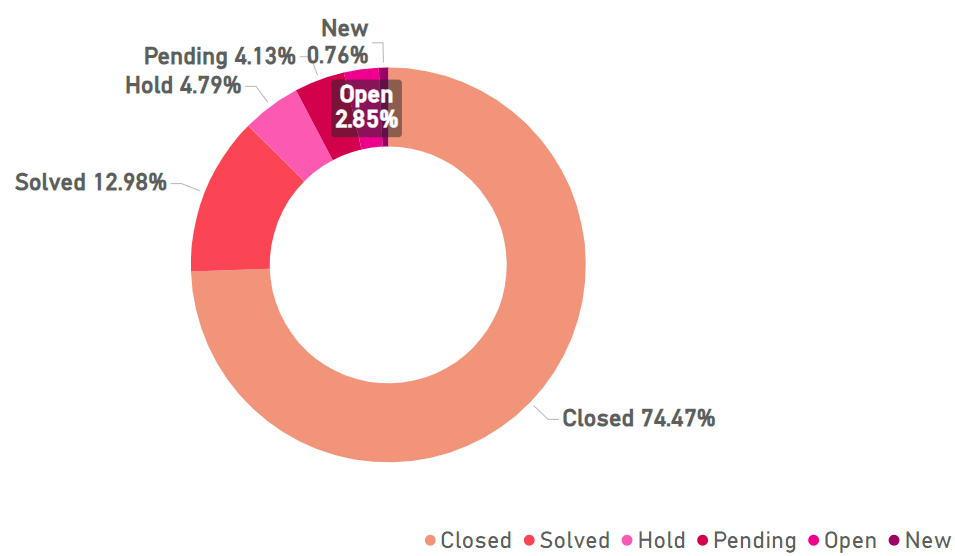{width="5.456994750656168in"
> height="3.1770548993875765in"}

*[Response Rate]{.underline}*: The rate at which customers have provided
feedback on the work done by our customer success team is found to be
**[\~14.91%]{.underline}**. This is calculated by the percentage of
total surveys that were offered to our customers and the percentage of
responses received. We have received **813** responses out of the total
**5453** surveys that were offered.

*[CSAT Score]{.underline}:* The CSAT Score (or Customer Satisfaction
score) measures the level of satisfaction that customers have with their
overall experience. Considering a response rate of 14.91%, the CSAT
score does not have a huge impact on the insights derived about the
team's performance, although it would give a glimpse into the customer's
experience with the responses and resolution.

The CSAT score was found to be **[4.33]{.underline}** out of a maximum
rating of 5, which indicates that customers who did provide feedback on
the survey have given an average rating of 4 to 5, indicating excellent
customer experience.

*[Average Resolution Time]{.underline}:* This is the average time taken
by the team to resolve a case/query raised by our customers. It was
found out from the data that the average time to resolve a query was
**[3.42 hours]{.underline}**.

*[Average Response Time]{.underline}:* This is the average time taken by
the team to respond to a case once the case is created. The response
time is obtained by subtracting the 'Created at' date/time from the
'Initially assigned at' date/time. The response time by our team was
found to be **[2.16 minutes]{.underline}** on an average.

*[Percentage of Cases solved and closed by each Group]{.underline}:* Out
of the 4 different groups under which the cases are received, it was
found out that 'Support' had the comparatively highest percentage of
solved cases out of the total cases handled with **49.02%** cases solved
and closed, and 'Onboardings had the lease cases solved and closed out
of the total cases handled.

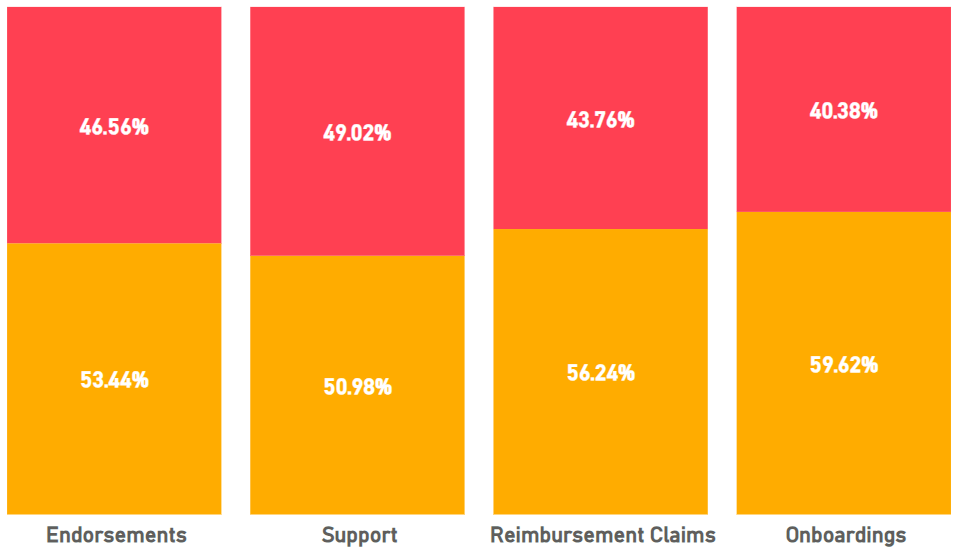{width="5.519273840769904in"
height="3.154694881889764in"}

*[Reopen Rate]{.underline}:* This is the percentage of cases that are
reopened after being marked as 'Solved'. A reopen rate of
**[26.23%]{.underline}** has been calculated where the customers have
reopened the cases after it being marked as 'Solved'.

*[Customer Satisfaction derived from each Medium of
inquiry]{.underline}:* An analysis was conducted to understand the
customer satisfaction that was recorded within each medium through which
customers reached out for queries. It was found that the greatest number
of cases raised by 'Closed Tickets' received the maximum customer
satisfaction score.

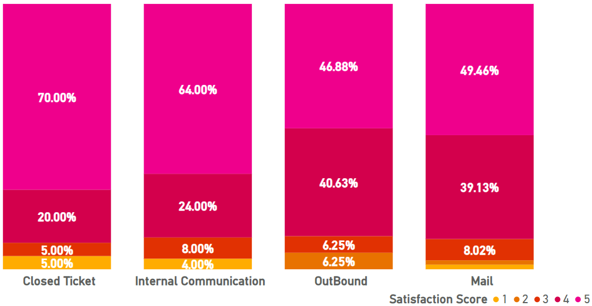{width="6.843346456692913in"
height="3.54621719160105in"}

From the above graph, it could be noted that **70%** of cases received
via 'Closed Ticket' got a customer feedback of 5, and **\<90%** of the
cases fall within the highest ratings given by the customers. The least
customer satisfaction ratings were given to cases raised through 'Mail',
indicating that customers prefer reaching out to us through Tickets over
emails.

*[Solved date vs. Number of cases]{.underline}:* From the below chart,
it could be noted that the number of cases solved varied between the
different days of the week. There is a dip in solved cases during the
**Weekends** (Saturdays and Sundays) while the highest number of cases
resolved, averaging around **250 -- 300** cases, were on the
**beginning** and **end** of the week (Mondays and Fridays). Although
the trend line shows a slight decrease in the number of cases solved,
the highest average number of cases were solved during the month of May
from the mid (15^th^) to the end (31^st^) of the month.

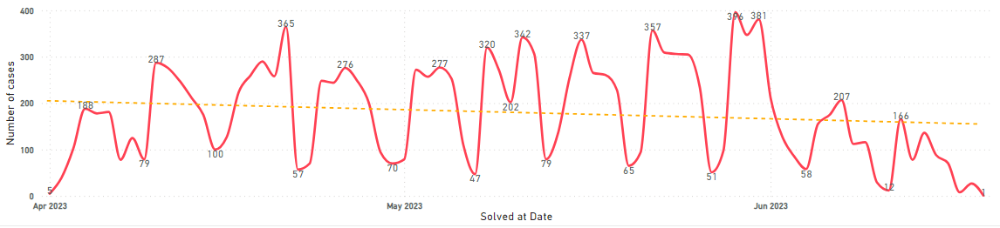{width="7.5in"
height="1.7145833333333333in"}

**2 (i). Team-wise Analysis (Charts)**

In this section, the team-wise analysis of the time consumed in
addressing a customer query is described. With the help of tables and
charts, the teams can be ranked based on their rate of responsiveness
and productivity.

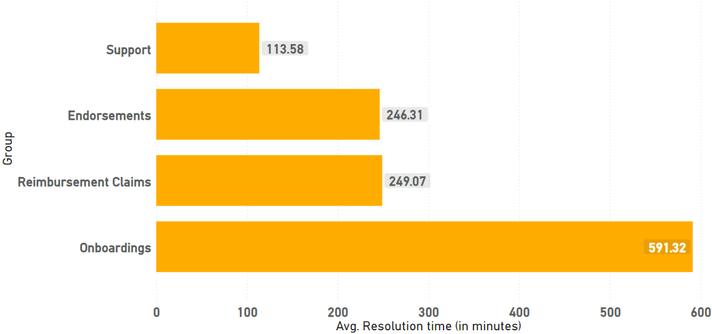{width="3.7952668416447946in"
height="1.7883989501312336in"}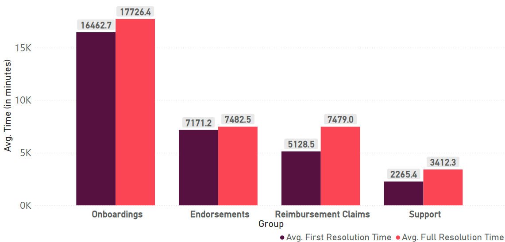{width="3.897276902887139in"
height="1.8483027121609799in"}

fig 1 fig 2

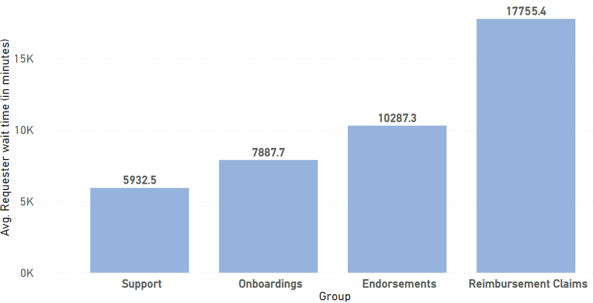{width="3.6954702537182853in"
height="1.8899693788276466in"}

fig 3

The above charts represent the average distribution of time taken by
each team in handling cases. The **average resolution time** (fig 1)
between the teams have been noted down, and the 'Support' team has been
identified to have the least average resolution time with **[1.8
hours]{.underline}** as their average resolution time. The **average
first and full resolution time** (fig 2) has been recorded to find out a
similar result, where the 'Support' team has taken the least time of
**[47 hours]{.underline}** on average. Additionally, the **customer wait
time** (fig 3) has also been depicted, where the 'Support' team has
managed to achieve the least average time of **[98.8
hours]{.underline}** or **4 days** of wait time by our customers.

**2 (ii). Team-wise Analysis (Tables)**

The above data can be similarly represented in the form of tables as
below:\
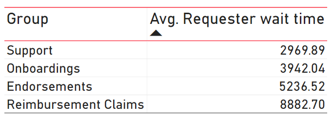{width="3.549008092738408in"
height="1.2791819772528434in"}
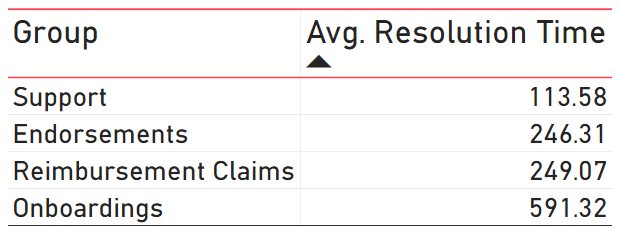{width="3.184423665791776in"
height="1.208238188976378in"}

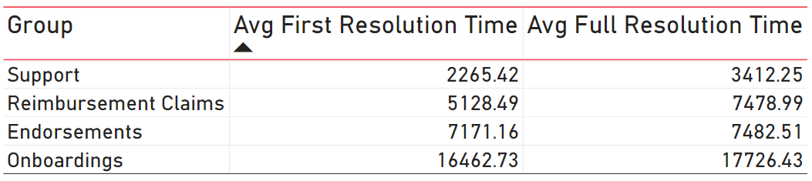{width="7.777723097112861in"
height="1.7361111111111112in"}

Concluding from the above, It can be denoted that the
**[Support]{.underline}** team has been identified to be the quickest
team that has handled cases in terms of response, wait and resolution
time and the **[Onboardings]{.underline}** team have been identified to
have utilized comparatively more time in doing the same.

From this, we could infer the overall working efficiency of the Customer
Success team. There has been a timely resolution of cases and in
addressing the customers promptly. Even though the response rate is low,
the CSAT score has been proved to show that the majority of the
customers appear to be satisfied with the resolution of their queries,
indicating that the team's efforts align with customer expectations.
Although the numbers look good, there are areas where improvements can
be made to further enhance customer experience, like reducing resolution
time particularly for urgent queries.

**2 (iii). Ticket-wise Analysis (Charts)**

Further observation on a ticket-level deep dive has been performed in
order to understand the customer experience, and in mapping out the time
taken for each type of medium in providing a resolution to the
customers' queries.

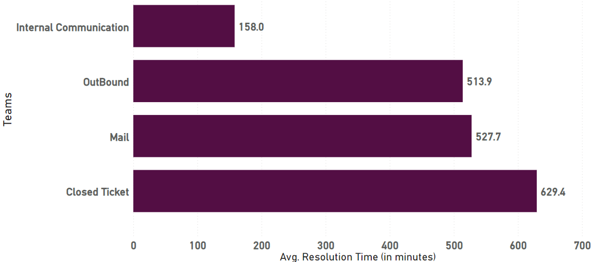{width="5.195784120734908in"
height="2.3541666666666665in"}

From this chart, inference on the shortest time taken by each case
system for resolved cases can be identified. Tickets raised via
**[Internal Communication]{.underline}** have been identified to be the
quickest with an average resolution time of **158 minutes**, while cases
raised via **[Closed Ticket]{.underline}** have been found to take the
most time to resolve with **629 minutes** or **10.5 hours** on average.

**2 (iv). Ticket-wise Analysis (Tables)**

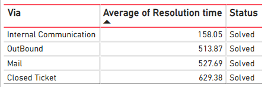{width="4.663591426071741in"
height="1.5510137795275591in"}

As depicted in the table, the numbers with the average resolution time
has been indicated, showing that cases raised via Internal Communication
have been found to be the quickest to be resolved and marked as
'Solved', while cases raised via 'Closed Ticket' have been most time
consuming in resolving.

**3. Data Types:**

From the dataset, the different data types can be inferred utilizing
which analysis can be conducted to retrieve useful and informative
insights. The following data types have been observed from the data:
'String', 'Integer', 'Decimal (float)', 'Timestamp with datetime'.

This can be better observed on a column level from the below chart. The
chart has been obtained from analysis of the data with the help of
Python libraries.

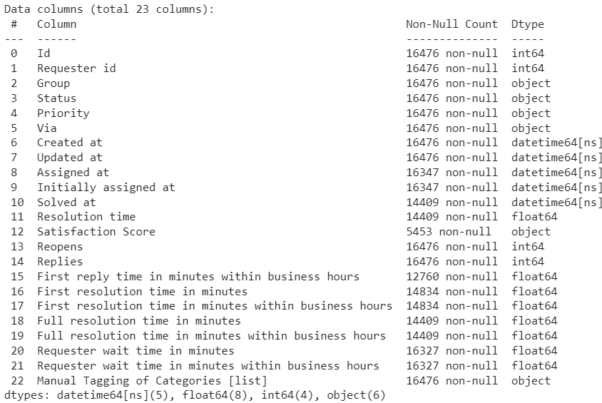{width="7.777723097112861in"
height="5.208333333333333in"}

**4. Conclusion:**

From the above analysis, insights that are critical to the Customer
Success team in determining growth in performance can be drawn, along
with understanding the customers' experience with the organization. A
short glimpse of the above analysis can be found below that consists of
the key facts and numbers:

+----------------------------------+-----------------------------------+
| **Key Factors**                  | **Output**                        |
+----------------------------------+-----------------------------------+
| **1. Efficiency:**               | The overall efficiency of the     |
|                                  | team is commendable, with a high  |
|   -------------- --------------  | percentage of cases solved, a     |
|   Solved Cases   87.45%          | satisfactory customer response    |
|                                  | rate and a high CSAT score. The   |
|   Customer       14.91%          | ability to maintain a relatively  |
|   Response Rate                  | low average resolution and        |
|                                  | response time with a low reopen   |
|   CSAT Score     4.33            | rate shows the dedication to      |
|                                  | prompt and effective resolution   |
|   Average        3.42 hours      | to customer queries.              |
|   Resolution                     |                                   |
|   time                           |                                   |
|                                  |                                   |
|   Average        2.16 minutes    |                                   |
|   Response time                  |                                   |
|                                  |                                   |
|   Reopen Rate    26.23%          |                                   |
|   -------------- --------------  |                                   |
+----------------------------------+-----------------------------------+
| **2. Quickest Group**            | Support                           |
+----------------------------------+-----------------------------------+
| **3. Slowest Group**             | Onboardings                       |
+----------------------------------+-----------------------------------+
| **4. Most aging ticket type**    | Closed Ticket                     |
+----------------------------------+-----------------------------------+

The overall dashboard with the primary numbers that reflect the
performance of the team can be found below:

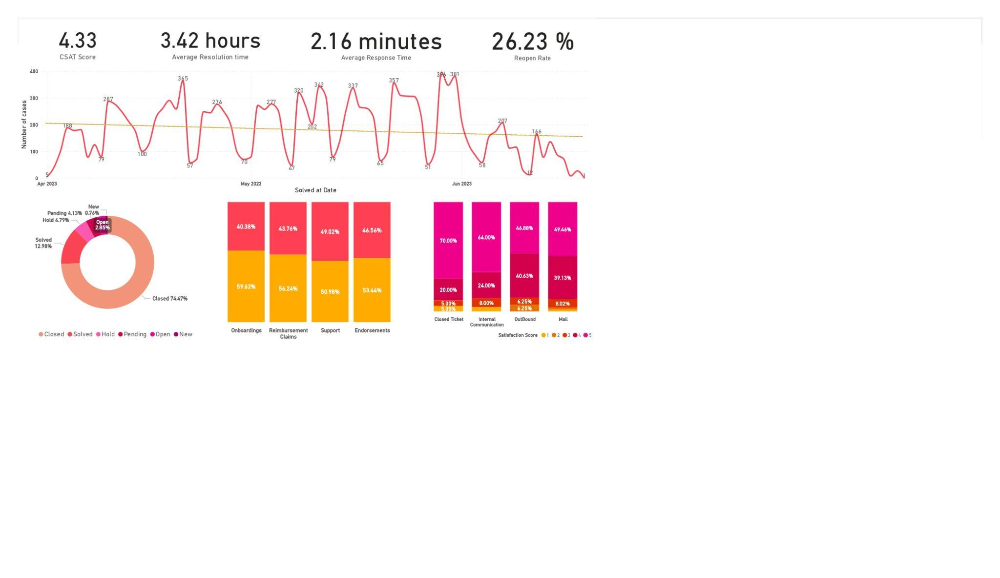{width="7.076813210848644in"
height="3.9571522309711287in"}
